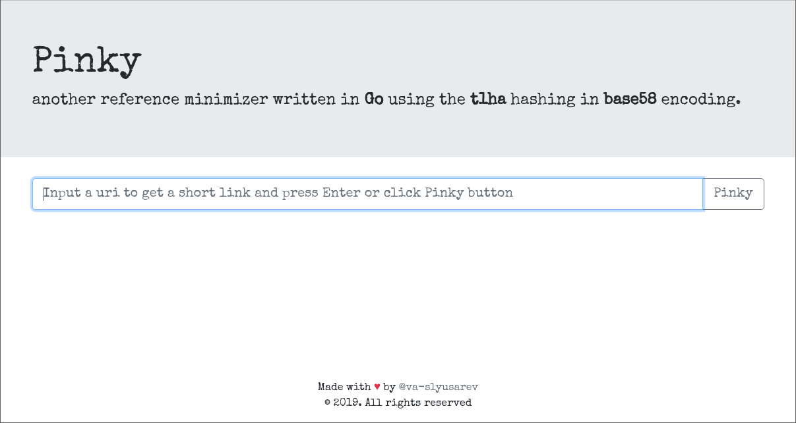

# PINKY
Another reference minimizer written in **Go** using the **t1ha** hashing in **base58** encoding.



## Run container local

```docker
docker build -t local/pinky .
```

```docker
docker run -d -p 8080:8080 local/pinky
```

## Run container from docker hub

```docker
docker run -d -p 8080:8080 vaslyusarev/pinky
```